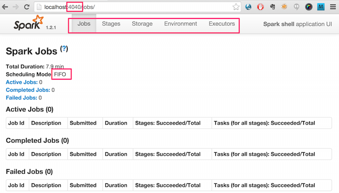

[<< back to main index](../README.md)

Lab 2.2 : Spark Shell
===================

### Overview
Get familiar with Spark shell

### Builds on
None

### Run time
approx. 20-30 minutes

### Notes
Java / Scala users follow **Scala** section

Python users follow **Python** section


----------------------------
STEP 1:  Launch  Spark shell
----------------------------

#### == Scala:
```bash
$   cd ~/spark-labs
$   git pull     # this will update the labs to latest

$   ~/spark/bin/spark-shell  ## spark shell is in bin/ dir
```

Console output will look like
```
    Welcome to
          ____              __
         / __/__  ___ _____/ /__
        _\ \/ _ \/ _ `/ __/  '_/
       /___/ .__/\_,_/_/ /_/\_\   version 1.4.1
          /_/
    Using Scala version 2.10.4 (Java HotSpot(TM) 64-Bit Server VM, Java 1.7.0_67)
    ...
    15/03/29 14:27:08 INFO SparkUI: Started SparkUI at http://localhost:4040
    Spark context available as sc.
    ...
    scala>

#### == Python:
    $   cd ~/spark-labs
    $   ~/spark/bin/pyspark
Console output will look like

    15/03/29 14:51:49 INFO SparkUI: Started SparkUI at http://localhost:4040
    ...
    Welcome to
          ____              __
         / __/__  ___ _____/ /__
        _\ \/ _ \/ _ `/ __/  '_/
       /__ / .__/\_,_/_/ /_/\_\   version 1.4.1
          /_/

    Using Python version 2.7.6 (default, Sep  9 2014 15:04:36)
    SparkContext available as sc.
    >>>
--------------------------------
STEP 2: Exploring Spark shell UI
--------------------------------
Spark shell UI is available on port 4040.

In browser go to :   http://your_machine_address:4040
(use 'public' ip of machine)

Here is a sample screen shot:



**==> Explore stage, storage, environment and executor tabs**

**==> Take note of 'Event Timeline', we will use this for monitoring our jobs later**

**==> Check spark master on port 8080,  Do you the Spark shell application connected?  Why (not)?**

---------------------
STEP 3: Spark context
---------------------
Within Spark  shell,  variable `sc` is the SparkContext
Type `sc` in scala prompt and see what happens.
Your output might look like this

#### == Scala

    scala> sc
    res0: org.apache.spark.SparkContext = org.apache.spark.SparkContext@5019fb90

#### == Python

    >>> sc
    <pyspark.context.SparkContext object at 0x10bbec190>

To see all methods in sc variable, type `sc.`  and `double-TAB`
This will show all the available methods on `sc` variable.
(This only works on Scala shell for now)

Try the following:

**==> Print the name of application name**
`sc.appName`

**==> Find the 'Spark master' for the shell**
`sc.master`


-------------------
STEP 4: Load a file
-------------------
We have data files under `spark-labs/data`
Use test file :  `data/twinkle/sample.txt` .
The file has a favorite nursery rhyme

    twinkle twinkle little star
    how I wonder what you are
    up above the world so high
    like a diamond in the sky
    twinkle twinkle little star

Let's load the file:

#### == Scala

    val f = sc.textFile("data/twinkle/sample.txt")

#### == Python

    f = sc.textFile("data/twinkle/sample.txt")

#### answer the following questions:
**==> What is the 'type' of f ?**
hint : type `f` on the console

**==> Inspect Spark Shell UI on port 4040, do you see any processing done?  Why (not)?**

**==> Print the first line / record from RDD**
hint : `f.first()`

**==> Again, inspect Spark Shell UI on port 4040, do you see any processing done?  Why (not)?**

**==> Print first 3 lines of RDD**
hint : `f.take()`

**==> Again, inspect Spark Shell UI on port 4040, do you see any processing done?  Why (not)?**

**==> Print all the content from the file**
hint : `f.collect()``

**==> How many lines are in the file?**
hint : `f.count()`

**==> Inspect the 'Jobs' section in Shell UI (in browser)**
Also inspect the event time line


**==> Inspect the 'Executor' section in Shell UI (in browser)**


**==> Quit spark-shell session `Control + D`**


-------------------------------------------
STEP 5:  Connecting Shell and  Spark server
-------------------------------------------

### 5.1 Start Spark Server
If Spark server is not running, start it as

    $ ~/spark/sbin/start-all.sh


Use `jps` command to inspect the java process.  Your output might look like this.

    731 Master
    902 Jps
    831 Worker

Spark master UI is available on port 8080.
In browser go to :   http://your_machine_address:8080
(use 'public' ip of machine)

Here is a sample screen shot:


### 5.2 Now start spark shell

#### == Scala:

    $ ~/spark/bin/spark-shell


#### == Python

    $ ~/spark/bin/pyspark


Once the shell starts, check the _server_ UI on port 8080.

**==> Do you see the shell connected as an application?  why (not) ?**

### Step 5.3 Connect Spark shell with the Spark server.
Make a note of Spark server uri (e.g  `spark://host_name:7077`)

**==> Restart spark shell as follows**

#### == Scala

    $   ~/spark/bin/spark-shell   --master  spark-server-uri
                                            ^^^^^^^^^^^^^^^^
                                        update this to match your spark server

    $   ~/spark/bin/spark-shell   --master  spark://localhost:7077

On an Amazon server you may have to use the internal ip for the spark server, such as

    ~/spark/bin/spark-shell  --master spark://ip-10-69-172-113:7077

#### == Python

    $   ~/spark/bin/pyspark   --master  spark-server-uri
                                        ^^^^^^^^^^^^^^^^
                                        update this to match your spark server

    $   ~/spark/bin/pyspark   --master  spark://localhost:7077


**==> Once the shell started, check both UIs**

#### spark server UI at port 8080


---
#### spark shell UI at  port 4040


----------------------------------------
STEP 6: Redo step (4) in the new shell
----------------------------------------
Now our shell is connected to a server
**==> Load file and test it as in Step (4)**

